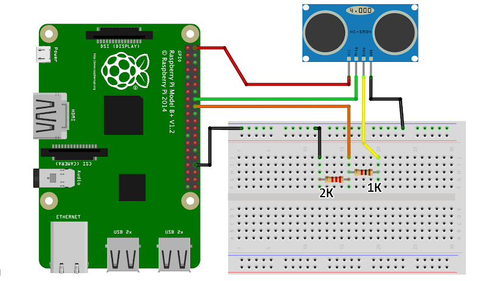

# Smart Parking - IoT

## Summary

The project we chose is about Smart Parking, with the use of a sonar and a Raspberry PI we can determine if a car is parked at a certain location.

## Hardware Prerequisites

For the project we need:

- 1kΩ Resistance
- 2kΩ Resistance
- Ultrasonic Sensor HC-SR04
- Breadboard
- Raspberry PI
- A few jumper wires for the connections to the Breadboard and the Raspberry PI

## Connection to the Raspberry PI

<p align = "center">
	
</p>
<p align = "center">
	Fig.1 Sonar - Breadbroad - Raspberry Connection
</p>

We need the resistances to create a voltage divider, so that the Sonar and the Raspberry PI can work correctly.

## Software Requirements

All of the Software requirements exist in the raspberry_pi file as requirements.txt and in the smart_parking directory as package.json. 

You can install the Python packages with this command:

```bash
python3 -m pip install -r requirements.txt
```

You can install the NodeJs module with this command:

```bash
npm init
```

## Brief Description
1. The Sonar sends a signal back to the Raspberry PI.
2. The Raspberry PI determines if the Parking Spot is taken or not and sends, using Wi-fi, the correct data to a Mongo Database.
3. After that the website or the Android App collects the latest entry in the Mongo Database and shows the user the state of the Parking Spot.


## Architecture

<p align = "center">
	
</p>
<p align = "center">
	Fig.2 Architecture
</p>

