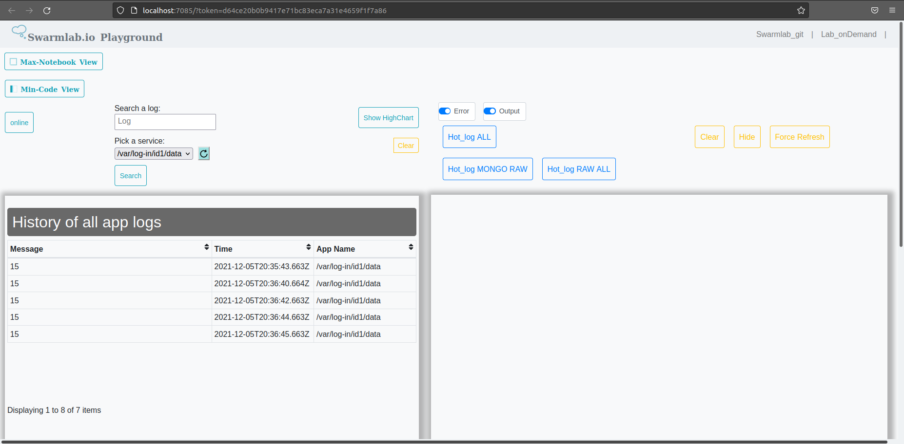
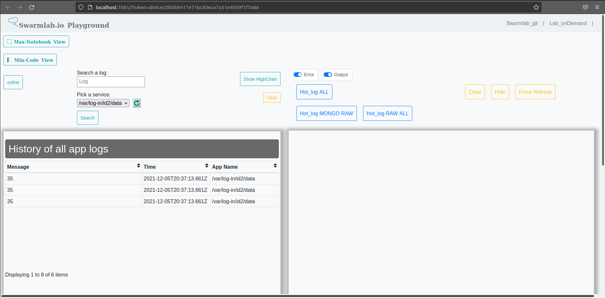

# Task 1

## Dummy_service

1. Execute: `docker exec -it dummy_service /bin/bash`.

2. Change to directory: `cd /var/log-in`.

3. Create directories to store sensor's data:

    `mkdir id1` <br>
    `mkdir id2`

4. Write data:

    For example:
    
    `echo "15" >> id1/data` <br>
    `echo "35" >> id2/data`

---

## Mongo

1. Execute: `docker exec -it mongo /bin/sh`.

2. Connect to mongo: `mongo`.

3. Show databases:

    * Before sensor's data

        ```bash
        admin   0.000GB
        config  0.000GB
        local   0.000GB
        ```

    * After sensor's data

        ```bash
        admin     0.000GB
        config    0.000GB
        fluentdb  0.000GB
        local     0.000GB
        ```

4. Execute: `use fluentdb`

5. Show all records: `db.test.find({})`

```bash
{ "_id" : ObjectId("61ad229ff088440024fc57d5"), "message" : "15", "tailed_path" : "/var/log-in/id1/data", "time" : ISODate("2021-12-05T20:35:43.663Z") }
{ "_id" : ObjectId("61ad22d8f088440024fc57d6"), "message" : "15", "tailed_path" : "/var/log-in/id1/data", "time" : ISODate("2021-12-05T20:36:40.664Z") }
{ "_id" : ObjectId("61ad22daf088440024fc57d7"), "message" : "15", "tailed_path" : "/var/log-in/id1/data", "time" : ISODate("2021-12-05T20:36:42.663Z") }
{ "_id" : ObjectId("61ad22dcf088440024fc57d8"), "message" : "15", "tailed_path" : "/var/log-in/id1/data", "time" : ISODate("2021-12-05T20:36:44.663Z") }
{ "_id" : ObjectId("61ad22ddf088440024fc57d9"), "message" : "15", "tailed_path" : "/var/log-in/id1/data", "time" : ISODate("2021-12-05T20:36:45.663Z") }
{ "_id" : ObjectId("61ad22f9f088440024fc57da"), "message" : "35", "tailed_path" : "/var/log-in/id2/data", "time" : ISODate("2021-12-05T20:37:13.661Z") }
{ "_id" : ObjectId("61ad22f9f088440024fc57db"), "message" : "35", "tailed_path" : "/var/log-in/id2/data", "time" : ISODate("2021-12-05T20:37:13.661Z") }
{ "_id" : ObjectId("61ad22f9f088440024fc57dc"), "message" : "35", "tailed_path" : "/var/log-in/id2/data", "time" : ISODate("2021-12-05T20:37:13.661Z") }
```

---

## Web client

### Logs of id1 sensor



### Logs of id2 sensor

